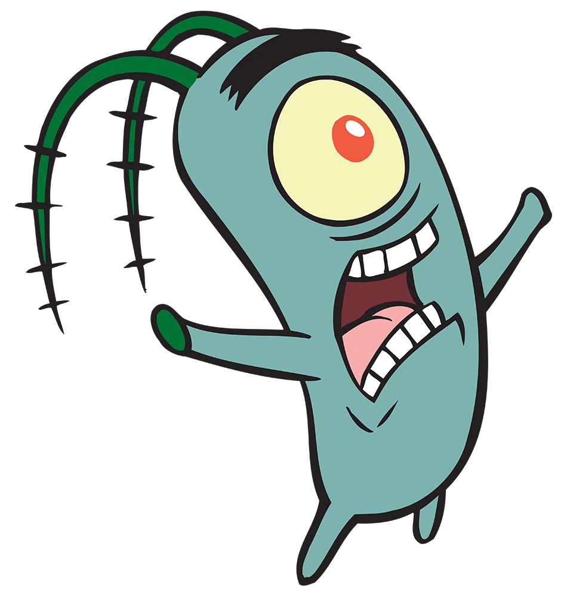

# Oi!

- Estudante de Ciência da Computação - UENP 📓
- Estudando C e Python 🤓☝️
- 🖥️

## Stats!

  <a href="https://github.com/GiovanaRiber">
  
  

 

  

 
## Contato

  
  

  <picture>
    <source media="(prefers-color-scheme: dark)" srcset="https://raw.githubusercontent.com/vieiranaju/vieiranaju/output/github-contribution-grid-snake-dark.svg">
    <source media="(prefers-color-scheme: light)" srcset="https://raw.githubusercontent.com/vieiranaju/vieiranaju/output/github-contribution-grid-snake.svg">
    
  </picture>
  
  

    
  

